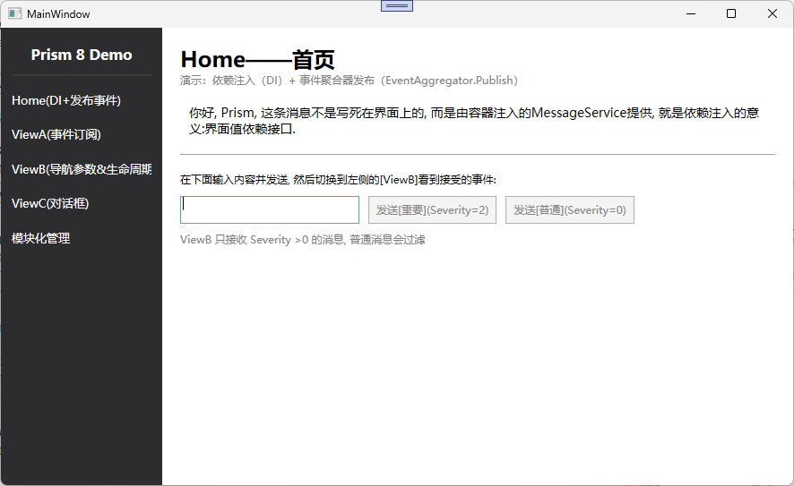
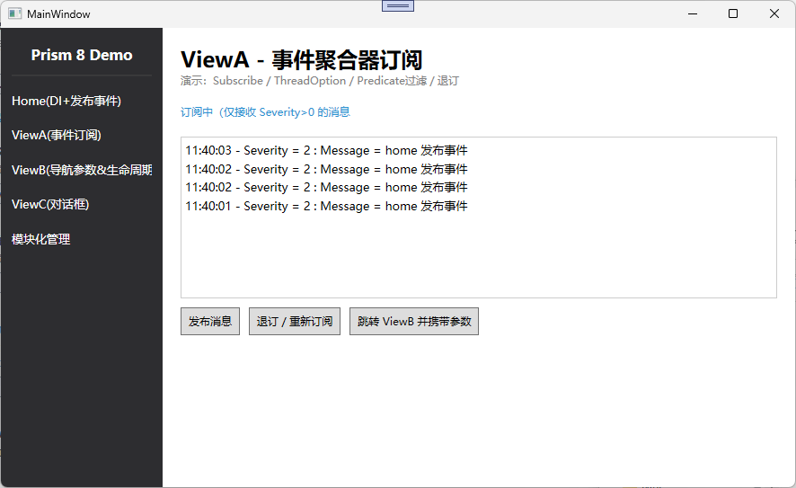
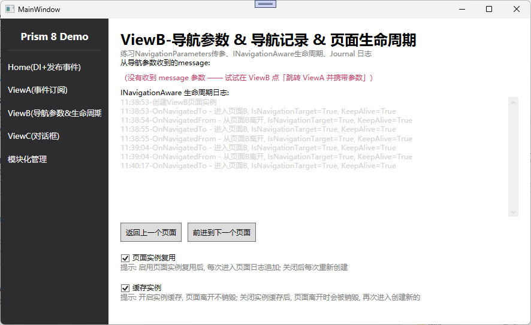
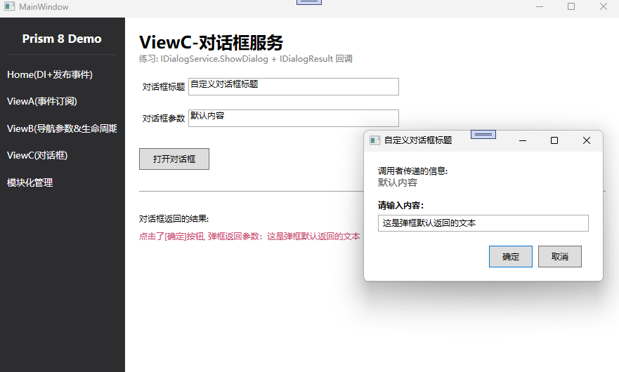
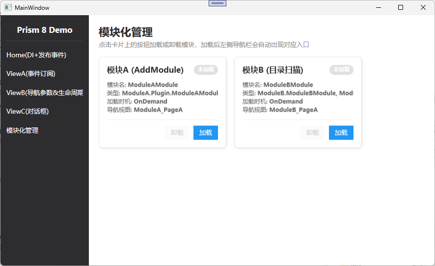
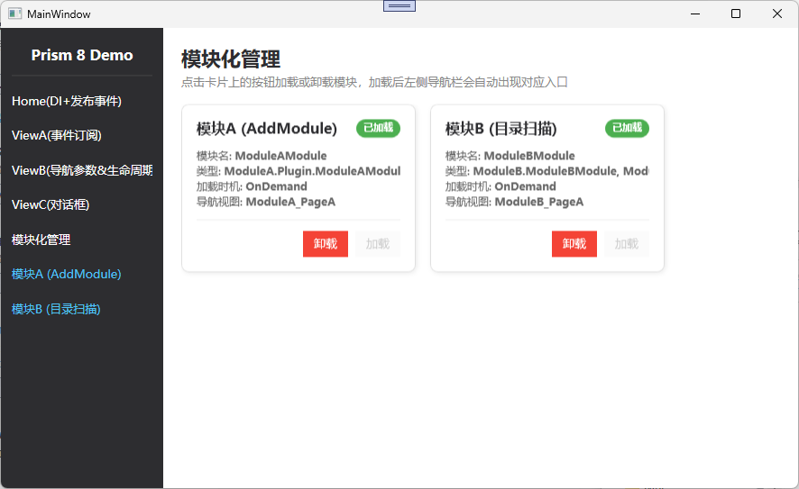
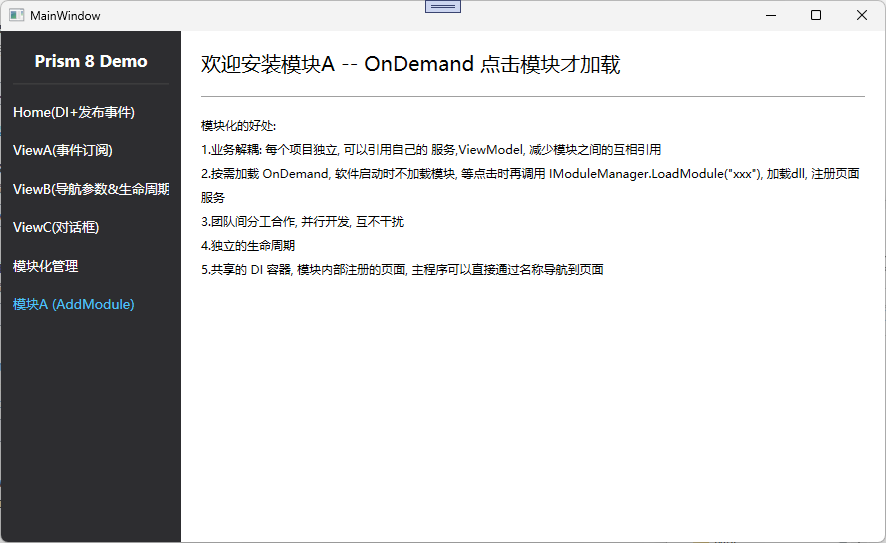

# WPF Prism 8 Demo 

> 项目基于 **Prism 8 + DryIoc + .NET 8 (WPF)**，涵盖 Prism 核心六大能力：**可拔插模块、依赖注入、区域导航、事件聚合器、对话框服务、MVVM 生命周期**。

---

## 目录

- [0. 项目整体架构](#0-项目整体架构)
- [1. 应用入口 App.xaml.cs — Prism 启动引导](#1-应用入口-appxamlcs--prism-启动引导)
- [2. MainWindow — 壳窗口与数据驱动导航栏](#2-mainwindow--壳窗口与数据驱动导航栏)
- [3. HomeView — 依赖注入 + 事件发布](#3-homeview--依赖注入--事件发布)
- [4. ViewA — 事件聚合器订阅](#4-viewa--事件聚合器订阅)
- [5. ViewB — 导航参数 & 生命周期 & Journal](#5-viewb--导航参数--生命周期--journal)
- [6. ViewC — 对话框服务](#6-viewc--对话框服务)
- [7. ViewCDialog — 对话框实现 IDialogAware](#7-viewcdialog--对话框实现-idialogaware)
- [8. Module — 模块化管理页](#8-module--模块化管理页)
- [9. ModuleA.Plugin — AddModule 手动注册模块](#9-moduleaplugin--addmodule-手动注册模块)
- [10. ModuleB.Plugin — DirectoryModuleCatalog 目录扫描模块](#10-modulebplugin--directorymodulecatalog-目录扫描模块)
- [11. 公共基础设施](#11-公共基础设施)

---

## 0. 项目整体架构

```
WpfPrism-Demo.sln
├── WpfPrism-Demo          # 主程序（壳 + 核心页面 + 基础设施）
│   ├── App.xaml.cs        # PrismApplication 启动引导
│   ├── Views/             # MainWindow, HomeView, ViewA/B/C, Module, ViewCDialog
│   ├── ViewModels/        # 对应 VM + NavItemViewModel + ModuleItemViewModel
│   ├── Events/            # MessageSentEvent, ModuleLoadedEvent, ModuleUnloadedEvent
│   ├── Services/          # IMessageService, MessageService, AppLocalStorageService
│   └── Styles/            # CommonStyle.xaml 全局样式
├── ModuleA.Plugin         # 模块A（AddModule 手动注册，OnDemand）
└── ModuleB.Plugin         # 模块B（DirectoryModuleCatalog 目录扫描，OnDemand）
```

**Prism 核心概念速查表：**

| 概念 | 接口/类 | 作用 |
|---|---|---|
| DI 容器 | `IContainerRegistry` / `IContainerProvider` | 注册（写）/ 解析（读） |
| 区域导航 | `IRegionManager` + `prism:RegionManager.RegionName` | 在指定区域切换视图 |
| 事件聚合器 | `IEventAggregator` + `PubSubEvent<T>` | 松耦合发布/订阅 |
| 对话框 | `IDialogService` + `IDialogAware` | MVVM 方式弹窗 |
| 模块化 | `IModule` + `IModuleManager` + `IModuleCatalog` | 按需加载程序集 |
| MVVM 基类 | `BindableBase` | `SetProperty` 实现 `INotifyPropertyChanged` |
| 命令 | `DelegateCommand` | 带 `CanExecute` 的命令 |

---

## 1. 应用入口 App.xaml.cs — Prism 启动引导

### 1.1 PrismApplication 启动调用链

`App` 继承 `PrismApplication`（本项目用 `Prism.DryIoc` 具体实现）后，Prism 接管整个启动流程：

```
OnStartup → Initialize
  1. CreateModuleCatalog()      创建模块目录（空目录 / 指定扫描目录）
  2. RegisterRequiredTypes()    内部注册 Prism 核心服务
  3. RegisterTypes()            ★ 必选：注册自己的服务/视图/对话框
  4. ConfigureModuleCatalog()   可选：向目录中手动添加模块
  5. CreateShell()              ★ 必选：创建主窗口（壳）
  6. InitializeShell()          内部完成
  7. InitializeModules()        内部：加载 WhenAvailable 模块
OnInitialized()                 启动完成，可做初始化导航
```

### 1.2 加载模块

**① 创建模块目录

```csharp
protected override IModuleCatalog CreateModuleCatalog()
{
    // 方式一：空目录，后续在 ConfigureModuleCatalog 中手动 AddModule
    // var moduleCatalog = new ModuleCatalog();

    // 方式二：目录扫描，自动发现 Modules 文件夹下的模块程序集
    var moduleCatalog = new DirectoryModuleCatalog()
    {
        ModulePath = Path.Combine(AppDomain.CurrentDomain.BaseDirectory, "Modules")
    };
    return moduleCatalog;
}
```

> 两种方式：ModuleA 通过 `ConfigureModuleCatalog` 手动注册
> ModuleB 通过 `DirectoryModuleCatalog` 扫描 `/Modules/` 目录自动发现。

**② 注册类型 — RegisterTypes**

```csharp
protected override void RegisterTypes(IContainerRegistry containerRegistry)
{
    // 注册服务（单例，接口→实现）
    containerRegistry.RegisterSingleton<IMessageService, MessageService>();

    // 注册服务（工厂方法，带构造参数）
    containerRegistry.RegisterSingleton<AppLocalStorageService>(() =>
        new AppLocalStorageService("app.storage.json"));

    // 注册可导航视图（RegisterForNavigation）
    containerRegistry.RegisterForNavigation<HomeView>();
    containerRegistry.RegisterForNavigation<ViewA>();
    // ...

    // 注册对话框（视图 + 对应 VM）
    containerRegistry.RegisterDialog<ViewCDialog, ViewCDialogViewModel>();
}
```

**③ 手动添加模块 — ConfigureModuleCatalog**

```csharp
protected override void ConfigureModuleCatalog(IModuleCatalog moduleCatalog)
{
    // OnDemand = 按需加载，启动时不加载，点击时才 LoadModule
    moduleCatalog.AddModule<ModuleA.Plugin.ModuleAModule>(mode: InitializationMode.OnDemand);
    base.ConfigureModuleCatalog(moduleCatalog);
}
```

**④ 创建壳 + 初始化导航**

```csharp
protected override Window CreateShell()
{
    // DryIoc 能自动解析未显式注册的具体类型
    return Container.Resolve<MainWindow>();
}

protected override void OnInitialized()
{
    base.OnInitialized(); // 显示外壳窗口

    // 初始化导航：把 HomeView 导航进 ContentRegion 区域
    var regionManager = Container.Resolve<IRegionManager>();
    regionManager.RequestNavigate("ContentRegion", "HomeView", res =>
    {
        Console.WriteLine($"导航到HomeView {res.Result}");
    });
}
```

### 1.3 知识点总结

- `PrismApplication` 是启动入口，重写关键方法即可接入 DI、模块化、导航
- `RegisterForNavigation<T>()` 注册的视图名默认为类名，也可传第二个参数自定义
- `InitializationMode.WhenAvailable` = 启动时自动加载；`OnDemand` = 按需加载
- `RequestNavigate(regionName, source, callback)` 第三个参数可调试导航结果

---

## 2. MainWindow — 壳窗口与数据驱动导航栏



### 2.1 区域定义 — Region

XAML 中通过附加属性定义导航区域：

```xml
<ContentControl prism:RegionManager.RegionName="ContentRegion" />
```

- `ContentRegion` 是区域名，`IRegionManager.RequestNavigate("ContentRegion", "ViewName")` 就是往这个区域塞视图
- 一个窗口可以定义多个 Region（如左侧导航区、右侧内容区、底部状态栏）

### 2.2 数据驱动导航栏 — ItemsControl

左侧导航栏不是写死的 Button 列表，而是绑定 `ObservableCollection<NavItemViewModel>`：

```xml
<ItemsControl ItemsSource="{Binding NavItems}">
    <ItemsControl.ItemTemplate>
        <DataTemplate DataType="{x:Type viewModels:NavItemViewModel}">
            <Button Content="{Binding DisplayName}"
                    Command="{Binding NavigateCommand}"
                    CommandParameter="{Binding ViewName}" />
        </DataTemplate>
    </ItemsControl.ItemTemplate>
</ItemsControl>
```

### 2.3 静态 + 动态导航项

`MainWindowViewModel` 中：

```csharp
// 静态导航项（主程序自带页面），构造函数中初始化
NavItems.Add(new NavItemViewModel("Home(DI+发布事件)", "HomeView") { NavigateCommand = NavigateCommand });
NavItems.Add(new NavItemViewModel("ViewA(事件订阅)", "ViewA") { NavigateCommand = NavigateCommand });
// ...

// 动态导航项：订阅 ModuleLoadedEvent，模块加载后自动添加
_eventAggregator.GetEvent<ModuleLoadedEvent>().Subscribe(OnModuleLoaded);
_eventAggregator.GetEvent<ModuleUnloadedEvent>().Subscribe(OnModuleUnloaded);
```


## 3. HomeView — 依赖注入 + 事件发布


### 3.1 依赖注入 DI — 构造注入接口

```csharp
public HomeViewModel(IMessageService messageService, IEventAggregator eventAggregator)
{
    _messageService = messageService;
    _eventAggregator = eventAggregator;

    // 注入的是接口，不依赖具体实现，实现可随时替换
    _homeReceiveMessage = messageService.Message();
}
```

**DI 三件套：**

1. **定义接口** `IMessageService`（`Services/IMessageService.cs`）
2. **实现类** `MessageService : IMessageService`
3. **注册** `containerRegistry.RegisterSingleton<IMessageService, MessageService>()`（在 `App.xaml.cs`）

> 类比 JavaScript：类似 Vue 的 `provide/inject` 或 Angular 的 DI，父级注册，后代注入使用，且注入的是抽象而非具体。

### 3.2 事件发布 — EventAggregator.Publish

```csharp
private void PublishMessage(int severity)
{
    _eventAggregator.GetEvent<MessageSentEvent>().Publish(
        new MessagePayload { Message = HomeSendMessage, Severity = severity });
}
```

- `MessageSentEvent : PubSubEvent<MessagePayload>` — 自定义事件只需继承，无需写实现
- `MessagePayload` 包含 `Message`、`Severity`（0=普通，1=提示，2=重要）、`Time`
- 发布方和订阅方互不引用，只通过 `IEventAggregator` 这个"信使"间接通信

### 3.3 DelegateCommand + CanExecute

```csharp
// 方式一：手动 RaiseCanExecuteChanged
this.PublishImportantCommand = new DelegateCommand(
    () => PublishMessage(2),
    CanPublishMessage);  // CanExecute 委托

// 属性变化时手动通知命令重新评估可执行状态
public string HomeSendMessage
{
    set {
        SetProperty(ref _homeSendMessage, value);
        PublishImportantCommand.RaiseCanExecuteChanged();
    }
}

// 方式二：ObservesProperty 自动监听
this.PublishNormalCommand = new DelegateCommand(
    () => PublishMessage(1), CanPublishMessage)
    .ObservesProperty(() => HomeSendMessage);
```

**`CanExecute` 机制：**
- `CanExecute` 只在初始化时自动调用一次
- 后续依赖值变化时，必须手动 `RaiseCanExecuteChanged()` 或用 `ObservesProperty()` 自动监听
- 返回 `false` 时按钮自动禁用（WPF 内置 `CommandManager` 会处理 UI 状态）

### 3.4 XAML 数据绑定

```xml
<TextBox Text="{Binding HomeSendMessage, UpdateSourceTrigger=PropertyChanged}" />
```

- `Binding` = 双向数据绑定（类比 Vue `v-model`）
- `UpdateSourceTrigger=PropertyChanged` = 输入立即更新源（默认是 `LostFocus`，类比 `v-on:input` vs `v-on:change`）

### 3.5 知识点总结

| 知识点 | 关键 API |
|---|---|
| 构造注入 | 构造函数参数为接口，容器自动注入实现 |
| 事件发布 | `IEventAggregator.GetEvent<T>().Publish(payload)` |
| 命令可用性 | `DelegateCommand(execute, canExecute)` |
| 手动刷新 | `command.RaiseCanExecuteChanged()` |
| 自动监听 | `.ObservesProperty(() => Prop)` |
| 实时绑定 | `UpdateSourceTrigger=PropertyChanged` |

---

## 4. ViewA — 事件聚合器订阅



### 4.1 Subscribe 四参数详解

```csharp
_token = _eventAggregator.GetEvent<MessageSentEvent>().Subscribe(
    OnMessageReceived,                          // ① 回调函数
    ThreadOption.UIThread,                      // ② 线程选项
    false,                                      // ③ 保持订阅者引用（false=弱引用）
    p => p.Severity > 0                         // ④ Predicate 过滤条件
);
```

| 参数 | 取值 | 说明 |
|---|---|---|
| ① action | `Action<T>` | 收到事件时的回调 |
| ② threadOption | `PublisherThread` / `UIThread` / `BackgroundThread` | 回调在哪个线程执行 |
| ③ keepSubscriberReferenceAlive | `bool` | `false`=弱引用，防止订阅者无法回收导致内存泄漏 |
| ④ filter | `Predicate<T>` | 过滤条件，不满足则不触发回调 |

> **本项目演示：** ViewA 只接收 `Severity > 0` 的消息，Home 页发送"普通"(Severity=0)时 ViewA 收不到，发送"重要"(Severity=2)时可以收到。

### 4.2 退订 — SubscriptionToken

```csharp
// Subscribe 返回 SubscriptionToken，用它可以退订
_token.Dispose();

// 重新订阅
_token = _eventAggregator.GetEvent<MessageSentEvent>().Subscribe(...);
```

- `SubscriptionToken` 是订阅的"句柄"，`Dispose()` 即退订
- 也可以用 `event.Unsubscribe(token)` 退订
- **最佳实践：** 在 `OnNavigatedFrom` 或 ViewModel 销毁时退订，防止内存泄漏

### 4.3 反向发布

ViewA 自己也可以发布事件（订阅者同时也是发布者）：

```csharp
private void PublishMessage()
{
    _eventAggregator.GetEvent<MessageSentEvent>().Publish(new MessagePayload
    {
        Message = "ViewA 发布信息, 等级为2",
        Severity = 2
    });
}
```

### 4.4 携带参数跳转 — INavigationAware

ViewA 实现了 `INavigationAware` 接口，这是 Prism 导航生命周期的核心：

```csharp
public class ViewAViewModel : BindableBase, INavigationAware
{
    // 导航到当前页面（实例创建完成后），可获取传入参数
    public void OnNavigatedTo(NavigationContext navigationContext)
    {
        // 获取当前 Region 的导航服务，用于跳转到其他页面
        _navigateService = navigationContext.NavigationService;
    }

    // 从本页面离开时（视图尚未销毁）
    public void OnNavigatedFrom(NavigationContext navigationContext) { }

    // 导航请求过来时，是否复用已存在的实例
    public bool IsNavigationTarget(NavigationContext navigationContext)
    {
        return true; // 复用，不重新创建
    }
}
```

**携带参数跳转：**

```csharp
private void GotoViewB()
{
    _navigateService.RequestNavigate("ViewB", new NavigationParameters {
        { "message", "Hello from ViewA" }
    });
}
```

### 4.5 ObservableCollection 集合

```csharp
public ObservableCollection<string> MessageContent { get; } = new();
```

- 实现了 `INotifyCollectionChanged`，集合 Add/Remove/Clear 时 UI 自动刷新
- `MessageContent.Insert(0, ...)` 在顶部插入新消息，最新消息显示在最上面

### 4.6 知识点总结

| 知识点 | 关键 API |
|---|---|
| 订阅 | `GetEvent<T>().Subscribe(action, threadOption, keepAlive, filter)` |
| 线程切换 | `ThreadOption.UIThread` 回调切回 UI 线程 |
| 弱引用 | `keepSubscriberReferenceAlive=false` 防内存泄漏 |
| 过滤 | `Predicate<T>` 只接收满足条件的事件 |
| 退订 | `SubscriptionToken.Dispose()` |
| 导航生命周期 | `INavigationAware` 三个方法 |
| 带参跳转 | `RequestNavigate("ViewB", new NavigationParameters { {"key", val} })` |

---

## 5. ViewB — 导航参数 & 生命周期 & Journal



### 5.1 接收导航参数

```csharp
public void OnNavigatedTo(NavigationContext navigationContext)
{
    if (navigationContext.Parameters.ContainsKey("message"))
    {
        ReceiveMessage = navigationContext.Parameters.GetValue<string>("message");
    }
}
```

- `NavigationParameters` 本质是 `KeyValuePair<string, object>` 集合
- `GetValue<T>("key")` 泛型获取并转换类型
- 没有参数时给出友好提示

### 5.2 Journal 导航历史 — 前进/后退

```csharp
private IRegionNavigationJournal? _journal;

public void OnNavigatedTo(NavigationContext navigationContext)
{
    // 获取当前 Region 的导航日志
    _journal = navigationContext.NavigationService.Journal;
}

// 返回上一页
GoBackCommand = new DelegateCommand(() => _journal?.GoBack());
// 前进到下一页
GoForwardCommand = new DelegateCommand(() => _journal?.GoForward());
```

- 每个 Region 有独立的 Journal，互不干扰
- `GoBack()` / `GoForward()` 类似浏览器的前进后退
- Journal 记录的是当前 Region 内的导航历史

### 5.3 页面生命周期 — INavigationAware

```csharp
public void OnNavigatedTo(NavigationContext navigationContext)
{
    LifeCycleLog += $"{time}-OnNavigatedTo - 进入页面B\n";
    // 用途：获取参数、初始化数据、开启订阅/定时器
}

public void OnNavigatedFrom(NavigationContext navigationContext)
{
    LifeCycleLog += $"{time}-OnNavigatedFrom - 从页面B离开\n";
    _timer?.Stop();
    // 用途：取消订阅、停止定时器、保存页面状态
}

public bool IsNavigationTarget(NavigationContext navigationContext)
{
    return IsNavigationStatus; // 可动态控制是否复用
}
```

### 5.4 KeepAlive vs IsNavigationTarget — 核心区别

ViewB 同时实现了 `IRegionMemberLifetime`：

```csharp
public class ViewBViewModel : BindableBase, INavigationAware, IRegionMemberLifetime
{
    public bool KeepAlive => KeepAliveStatus; // 控制离开时是否销毁
}
```

**两者的本质区别：**

| 维度 | `KeepAlive` (IRegionMemberLifetime) | `IsNavigationTarget` (INavigationAware) |
|---|---|---|
| 控制什么 | 实例在 Region 中**是否会被销毁** | 导航请求过来时**是否复用已有实例** |
| 触发时机 | 离开页面时 | 新导航请求到达时 |

**五种组合的行为：**

| KeepAlive | IsNavigationTarget | 行为 |
|---|---|---|
| false | false | 每次进来创建新实例，离开销毁 |
| false | true | 离开销毁，下次想复用但实例不存在，仍创建新的 |
| true | false | 离开不销毁，但下次不复用，创建新实例 → **内存越堆越多** |
| true | true | 每次进来复用实例，离开不销毁（最常用） |
| — | — | 推荐组合：`KeepAlive=true` + `IsNavigationTarget=true` |

### 5.5 本地存储 — AppLocalStorageService

ViewB 的两个 CheckBox 状态通过本地存储持久化：

```csharp
// 保存
_appLocalStorageService.SetItem("ViewB_KeepAliveStatus", value.ToString());

// 读取
IsNavigationStatus = _appLocalStorageService.GetItem("ViewB_IsNavigationStatus") == "True";
```

`AppLocalStorageService` 是基于 JSON 文件的简易本地存储（类比浏览器 `localStorage`）：

| 方法 | 说明 |
|---|---|
| `SetItem(key, value)` | 存字符串 |
| `GetItem(key)` | 读字符串 |
| `SetObject<T>(key, obj)` | 存对象（自动 JSON 序列化） |
| `GetObject<T>(key)` | 读对象（自动反序列化） |
| `RemoveItem(key)` | 删除 |
| `Clear()` | 清空 |

### 5.6 内存泄漏演示 — DispatcherTimer

```csharp
public void OnNavigatedTo(NavigationContext navigationContext)
{
    _timer = new DispatcherTimer();
    _timer.Interval = TimeSpan.FromSeconds(1);
    _timer.Tick += (s, e) => Console.WriteLine("Timer Tick");
    _timer.Start();
}

public void OnNavigatedFrom(NavigationContext navigationContext)
{
    _timer?.Stop(); // 离开时停止，防止内存泄漏
}
```

> 如果 `KeepAlive=false` 且离开时不停止 Timer，Timer 会持有 ViewModel 引用导致无法 GC，这就是典型的内存泄漏场景。

### 5.7 知识点总结

- `NavigationParameters` 跨页面传参，`OnNavigatedTo` 中接收
- `IRegionNavigationJournal` 实现前进/后退
- `INavigationAware` 三方法 = 导航生命周期钩子
- `IRegionMemberLifetime.KeepAlive` 控制实例销毁
- `KeepAlive` 与 `IsNavigationTarget` 配合使用，不当组合会内存泄漏
- `AppLocalStorageService` 提供类似 localStorage 的持久化能力

---

## 6. ViewC — 对话框服务



### 6.1 IDialogService.ShowDialog

```csharp
private void OpenDialog()
{
    var parameters = new DialogParameters {
        { "Prompt", DialogInput },
        { "Title", DialogTitle }
    };

    _dialogService.ShowDialog("ViewCDialog", parameters, result =>
    {
        if (result.Result == ButtonResult.OK)
        {
            var res = result.Parameters.GetValue<string>("result");
            DialogResult = $"点击了[确定], 返回参数：{res}";
        }
        else
        {
            DialogResult = $"点击了[取消], {result.Result}";
        }
    });
}
```

**三个参数：**

| 参数 | 类型 | 说明 |
|---|---|---|
| ① name | `string` | 对话框注册名（在 App.xaml.cs 中 `RegisterDialog` 注册） |
| ② parameters | `IDialogParameters` | 传给对话框的参数 |
| ③ callback | `Action<IDialogResult>` | 对话框关闭后的回调，接收返回结果 |

### 6.2 对话框注册

在 `App.xaml.cs` 的 `RegisterTypes` 中：

```csharp
containerRegistry.RegisterDialog<ViewCDialog, ViewCDialogViewModel>();
```

- 第一个泛型是对话框的 View（UserControl）
- 第二个泛型是对应的 ViewModel（必须实现 `IDialogAware`）
- Prism 会自动把 View 装进默认的对话框宿主窗口中

### 6.3 IDialogResult

```csharp
public interface IDialogResult
{
    ButtonResult Result { get; }       // OK / Cancel / None / Yes / No / Retry / Abort
    IDialogParameters Parameters { get; } // 对话框返回的参数
}
```

### 6.4 知识点总结

- `IDialogService` 是 Prism 提供的 MVVM 友好对话框服务
- 对话框 View 是普通 `UserControl`，Prism 自动包装成窗口
- 通过 `DialogParameters` 双向传参（调用方→对话框，对话框→调用方）
- 回调中通过 `ButtonResult` 判断用户点击了哪个按钮

---

## 7. ViewCDialog — 对话框实现 IDialogAware

### 7.1 IDialogAware 接口

对话框的 ViewModel 必须实现 `IDialogAware`：

```csharp
public class ViewCDialogViewModel : BindableBase, IDialogAware
{
    // 对话框标题（绑定到宿主窗口的 Title）
    public string Title { get; set; }

    // 关闭对话框事件，DialogService 订阅此事件
    public event Action<IDialogResult> RequestClose;

    // 打开对话框时触发，接收调用者传递的参数
    public void OnDialogOpened(IDialogParameters parameters)
    {
        if (parameters.ContainsKey("Prompt"))
            Prompt = parameters.GetValue<string>("Prompt");
        if (parameters.ContainsKey("Title"))
            Title = parameters.GetValue<string>("Title");
    }

    // 是否允许关闭（返回 false 可阻止关闭，如未保存内容时）
    public bool CanCloseDialog() => true;

    // 对话框关闭后触发
    public void OnDialogClosed() => Console.WriteLine("弹框关闭");
}
```

### 7.2 关闭对话框并返回结果

```csharp
// 确定按钮
private void OkCallBack()
{
    var p = new DialogParameters { { "result", InputText } };
    var result = new DialogResult(ButtonResult.OK, p);
    RequestClose?.Invoke(result); // 触发关闭，携带结果
}

// 取消按钮
CancelCommand = new DelegateCommand(() =>
    RequestClose.Invoke(new DialogResult(ButtonResult.Cancel)));
```

### 7.3 对话框 XAML 结构

```xml
<UserControl x:Class="WpfPrism_Demo.Views.ViewCDialog">
    <StackPanel Margin="20" MinWidth="300">
        <TextBlock Text="{Binding Prompt}" />
        <TextBox Text="{Binding InputText, UpdateSourceTrigger=PropertyChanged}"/>
        <StackPanel Orientation="Horizontal" HorizontalAlignment="Right">
            <Button Content="确定" Command="{Binding OkCommand}" IsDefault="True"/>
            <Button Content="取消" Command="{Binding CancelCommand}" IsCancel="True"/>
        </StackPanel>
    </StackPanel>
</UserControl>
```

- `IsDefault="True"` = 按回车触发
- `IsCancel="True"` = 按 Esc 触发

### 7.4 完整交互流程

```
ViewC 调用 ShowDialog("ViewCDialog", params, callback)
  ↓
Prism 创建 ViewCDialog 窗口 + ViewCDialogViewModel
  ↓
调用 OnDialogOpened(parameters) → VM 接收参数
  ↓
用户操作 → 点击确定/取消
  ↓
VM 调用 RequestClose.Invoke(dialogResult)
  ↓
Prism 关闭窗口，调用 callback(result)
  ↓
ViewC 在回调中处理返回结果
```

### 7.5 知识点总结

| 知识点 | 说明 |
|---|---|
| `IDialogAware` | 对话框 VM 必须实现的接口 |
| `OnDialogOpened` | 接收传入参数 |
| `RequestClose` | 触发关闭对话框的事件 |
| `DialogResult` | 封装 `ButtonResult` + 返回参数 |
| `CanCloseDialog` | 返回 false 可阻止关闭 |
| `OnDialogClosed` | 关闭后的清理钩子 |

---

## 8. Module — 模块化管理页

### 8.1 未加载状态



### 8.2 已加载状态



### 8.3 读取模块列表 — IModuleCatalog

```csharp
private void RefreshModules()
{
    Modules.Clear();
    foreach (var info in _moduleCatalog.Modules)
    {
        var item = new ModuleItemViewModel(info);
        // ...
        Modules.Add(item);
    }
}
```

- `IModuleCatalog.Modules` 包含所有已注册模块的元数据
- 每个 `IModuleInfo` 包含：`ModuleName`、`ModuleType`、`InitializationMode`、`State`

### 8.4 加载模块 — IModuleManager.LoadModule

```csharp
private void LoadModule(ModuleItemViewModel item)
{
    item.State = ModuleState.Loading;
    try
    {
        // Prism 核心：按模块名加载
        // 调用链：加载程序集 → RegisterTypes 注册 → OnInitialized 初始化
        _moduleManager.LoadModule(item.ModuleName);
        item.State = ModuleState.Loaded;

        // 发布事件，通知 MainWindow 在侧边栏添加导航入口
        _eventAggregator.GetEvent<ModuleLoadedEvent>().Publish(
            new ModuleLoadedPayload {
                ModuleName = item.ModuleName,
                NavigationViewName = item.NavigationViewName,
                DisplayName = item.DisplayName
            });
    }
    catch { item.State = ModuleState.NotLoaded; throw; }
}
```

### 8.5 逻辑卸载 — Prism 不支持真正卸载

```csharp
private void UnloadModule(ModuleItemViewModel item)
{
    // 发布卸载事件，通知 MainWindow 从侧边栏移除导航项
    _eventAggregator.GetEvent<ModuleUnloadedEvent>().Publish(item.ModuleName);
    // 重置卡片状态
    item.State = ModuleState.NotLoaded;
}
```

> **重要原理：** Prism 的 `IModuleManager` 没有 `UnloadModule` 方法。原因是模块加载时向 DI 容器注册了类型，而 DryIoc 等容器不支持运行时移除已注册类型。.NET 中也无法直接卸载程序集（除非用 `AssemblyLoadContext` 隔离）。因此这里实现的是**逻辑卸载**：隐藏导航入口 + 重置状态标记。

### 8.6 ModuleItemViewModel — 卡片状态机

```csharp
public enum ModuleState { NotLoaded, Loading, Loaded }

public ModuleState State
{
    set {
        if (SetProperty(ref _state, value))
        {
            RaisePropertyChanged(nameof(StateText)); // 通知计算属性刷新
            LoadCommand?.RaiseCanExecuteChanged();    // 刷新按钮可用状态
            UnloadCommand?.RaiseCanExecuteChanged();
        }
    }
}

public string StateText => State switch
{
    ModuleState.NotLoaded => "未加载",
    ModuleState.Loading => "加载中...",
    ModuleState.Loaded => "已加载",
};
```

**命令可用性绑定状态：**

```csharp
item.LoadCommand = new DelegateCommand(
    () => LoadModule(item),
    () => item.State == ModuleState.NotLoaded);  // 仅未加载时可点

item.UnloadCommand = new DelegateCommand(
    () => UnloadModule(item),
    () => item.State == ModuleState.Loaded);     // 仅已加载时可点
```

### 8.7 卡片 UI — ItemsControl + WrapPanel

```xml
<ItemsControl ItemsSource="{Binding Modules}">
    <ItemsControl.ItemsPanel>
        <ItemsPanelTemplate>
            <WrapPanel Orientation="Horizontal"/> <!-- 自动换行 -->
        </ItemsPanelTemplate>
    </ItemsControl.ItemsPanel>
    <ItemsControl.ItemTemplate>
        <DataTemplate DataType="{x:Type viewModels:ModuleItemViewModel}">
            <!-- 卡片：圆角边框 + 阴影 + 状态标签 + 按钮 -->
        </DataTemplate>
    </ItemsControl.ItemTemplate>
</ItemsControl>
```

**状态标签颜色通过 DataTrigger 切换：**

```xml
<DataTrigger Binding="{Binding State}" Value="Loaded">
    <Setter Property="Background" Value="#4CAF50"/> <!-- 绿色 -->
</DataTrigger>
<DataTrigger Binding="{Binding State}" Value="Loading">
    <Setter Property="Background" Value="#FF9800"/> <!-- 橙色 -->
</DataTrigger>
```

### 8.8 模块加载完整流程

```
用户点击"加载"按钮
  ↓
ModuleViewModel.LoadModule()
  ↓
IModuleManager.LoadModule("ModuleAModule")
  ↓
Prism 加载 ModuleA.Plugin.dll
  ↓
调用 ModuleAModule.RegisterTypes() → 注册 PageA 视图
  ↓
调用 ModuleAModule.OnInitialized()
  ↓
ModuleViewModel 发布 ModuleLoadedEvent
  ↓
MainWindowViewModel 收到事件 → 侧边栏 Add 导航按钮
  ↓
用户点击新出现的导航按钮 → RequestNavigate → 显示模块页面
```

### 8.9 知识点总结

- `IModuleCatalog` 读取模块元数据，`IModuleManager.LoadModule` 按需加载
- Prism 不支持真正卸载模块，只能逻辑卸载（隐藏入口 + 重置状态）
- `ModuleItemViewModel` 封装状态机，驱动按钮可用性和 UI 显示
- `EventAggregator` 实现 Module 页面与 MainWindow 的解耦通信
- `ItemsControl` + `WrapPanel` 实现响应式卡片布局
- 计算属性（`StateText`）依赖其他属性时，需手动 `RaisePropertyChanged`

---

## 9. ModuleA.Plugin — AddModule 手动注册模块



### 9.1 IModule 接口

每个 Prism 模块必须实现 `IModule`：

```csharp
public class ModuleAModule : IModule
{
    // 注册模块自己的视图/服务到共享 DI 容器
    public void RegisterTypes(IContainerRegistry containerRegistry)
    {
        containerRegistry.RegisterForNavigation<PageA>("ModuleA_PageA");
    }

    // 模块初始化完成（容器已注册完毕）
    public void OnInitialized(IContainerProvider containerProvider)
    {
        Console.WriteLine("ModuleA初始化完成");
    }
}
```

| 方法 | 调用时机 | 用途 |
|---|---|---|
| `RegisterTypes` | 模块加载时 | 注册视图、服务、对话框到共享容器 |
| `OnInitialized` | RegisterTypes 之后 | 初始化逻辑、获取服务引用 |

### 9.2 注册方式 — AddModule

在主程序 `App.xaml.cs` 的 `ConfigureModuleCatalog` 中：

```csharp
moduleCatalog.AddModule<ModuleA.Plugin.ModuleAModule>(mode: InitializationMode.OnDemand);
```

- 主程序需要**直接引用** ModuleA.Plugin 项目（因为用了泛型 `AddModule<T>`）
- `OnDemand` = 启动时不加载，点击"加载"按钮才加载

### 9.3 模块内部页面

ModuleA 的 `PageA.xaml` 展示了模块化的好处：

```
模块化的好处:
1. 业务解耦：每个项目独立，引用自己的服务/ViewModel，减少模块间互相引用
2. 按需加载 OnDemand：启动时不加载，点击时才 LoadModule 加载 dll、注册页面
3. 团队分工合作，并行开发，互不干扰
4. 独立的生命周期
5. 共享的 DI 容器：模块内部注册的页面，主程序可直接通过名称导航
```

### 9.4 知识点总结

- `IModule` 是模块的入口，`RegisterTypes` + `OnInitialized` 两方法
- `AddModule<T>()` 方式需要主程序引用模块项目
- 模块注册的视图名（如 `ModuleA_PageA`）在整个共享容器中可用
- 模块和主程序共享同一个 DI 容器

---

## 10. ModuleB.Plugin — DirectoryModuleCatalog 目录扫描模块

### 10.1 [Module] 特性声明

ModuleB 不需要在主程序中手动 `AddModule`，而是通过**目录扫描**自动发现：

```csharp
[Module(ModuleName = "ModuleBModule", OnDemand = true)]
// [ModuleDependency("ModuleA")] // 可声明模块间依赖
public class ModuleBModule : IModule
{
    public void RegisterTypes(IContainerRegistry containerRegistry)
    {
        containerRegistry.RegisterForNavigation<PageA>("ModuleB_PageA");
    }

    public void OnInitialized(IContainerProvider containerProvider) { }
}
```

### 10.2 目录扫描配置

在 `App.xaml.cs` 的 `CreateModuleCatalog` 中：

```csharp
var moduleCatalog = new DirectoryModuleCatalog()
{
    ModulePath = Path.Combine(AppDomain.CurrentDomain.BaseDirectory, "Modules")
};
```

- Prism 启动时扫描 `bin/Debug/net8.0-windows/Modules/` 目录
- 找到标有 `[Module]` 特性且实现 `IModule` 的类，自动加入模块目录
- **主程序不需要引用 ModuleB.Plugin 项目**，实现完全解耦

### 10.3 两种模块注册方式对比

| 维度 | AddModule（ModuleA） | DirectoryModuleCatalog（ModuleB） |
|---|---|---|
| 注册位置 | `ConfigureModuleCatalog` 中代码注册 | `CreateModuleCatalog` 中指定扫描目录 |
| 主程序引用 | 需要引用模块项目 | 不需要引用，完全解耦 |
| 模块声明 | 无特殊特性 | 需要 `[Module]` 特性 |
| 适用场景 | 模块少、关系明确 | 插件式架构、动态扩展 |
| 部署方式 | 随主程序编译输出 | 需把 dll 复制到 Modules 目录 |

### 10.4 模块依赖

```csharp
[ModuleDependency("ModuleA")] // ModuleB 依赖 ModuleA
```

- 声明依赖后，Prism 会确保 ModuleA 先于 ModuleB 加载
- 可声明多个依赖：`[ModuleDependency("ModuleA"), ModuleDependency("ModuleC")]`

### 10.5 知识点总结

- `[Module(ModuleName, OnDemand)]` 特性标记模块类
- `DirectoryModuleCatalog` 扫描指定目录自动发现模块，实现插件式架构
- `[ModuleDependency]` 声明模块间加载顺序
- 目录扫描方式下，主程序与模块零引用耦合

---

## 11. 公共基础设施

### 11.1 事件定义 — Events/

**MessageSentEvent（消息事件）：**

```csharp
public class MessagePayload
{
    public string Message { get; set; } = string.Empty;
    public int Severity { get; set; }          // 0=普通, 1=提示, 2=重要
    public DateTime Time { get; set; } = DateTime.Now;
}

public class MessageSentEvent : PubSubEvent<MessagePayload> { }
```

**ModuleLoadedEvent / ModuleUnloadedEvent（模块事件）：**

```csharp
public class ModuleLoadedEvent : PubSubEvent<ModuleLoadedPayload> { }
public class ModuleLoadedPayload
{
    public string ModuleName { get; set; }
    public string NavigationViewName { get; set; }
    public string DisplayName { get; set; }
}

public class ModuleUnloadedEvent : PubSubEvent<string> { } // 直接传模块名
```

> 自定义事件只需继承 `PubSubEvent<T>`，无需任何实现。T 是事件携带的数据类型。

### 11.2 服务 — Services/

**IMessageService + MessageService（DI 演示）：**

```csharp
public interface IMessageService { string Message(); }

public class MessageService : IMessageService
{
    public string Message() => "通过 DryIoc 容器注入的信息...";
}
```

**AppLocalStorageService（JSON 本地存储）：**

- 基于 `System.Text.Json` 序列化到 `app.storage.json`
- 提供 `SetItem` / `GetItem` / `SetObject<T>` / `GetObject<T>` / `RemoveItem` / `Clear`
- 注册时用工厂方法指定文件名：`RegisterSingleton(() => new AppLocalStorageService("app.storage.json"))`

### 11.3 全局样式 — Styles/CommonStyle.xaml

```xml
<Style x:Key="Title" TargetType="TextBlock">
    <Setter Property="FontSize" Value="24"/>
    <Setter Property="FontWeight" Value="Bold"/>
</Style>
<Style x:Key="Subtitle" TargetType="TextBlock">
    <Setter Property="FontSize" Value="12"/>
    <Setter Property="Foreground" Value="Gray"/>
</Style>
<!-- 隐式样式：所有 Button 默认应用 -->
<Style TargetType="Button">
    <Setter Property="Margin" Value="0,0,10,0"/>
    <Setter Property="Padding" Value="8,7"/>
</Style>
```

在 `App.xaml` 中通过 `MergedDictionaries` 引入：

```xml
<ResourceDictionary.MergedDictionaries>
    <ResourceDictionary Source="/Styles/CommonStyle.xaml"/>
</ResourceDictionary.MergedDictionaries>
```

### 11.4 BindableBase — MVVM 基类

所有 ViewModel 继承 `Prism.Mvvm.BindableBase`，它实现了 `INotifyPropertyChanged`：

```csharp
private string _name;
public string Name
{
    get => _name;
    set => SetProperty(ref _name, value); // 自动比较并触发 PropertyChanged
}
```

- `SetProperty` 内部比较新旧值，不同才触发通知，避免无效刷新
- 手动通知其他属性：`RaisePropertyChanged(nameof(OtherProp))`

---

## 附录：Prism 核心能力与页面对照表

| Prism 能力 | 演示页面 | 核心 API |
|---|---|---|
| 启动引导 | App.xaml.cs | `PrismApplication`, `CreateShell`, `RegisterTypes` |
| 区域导航 | MainWindow, ViewA, ViewB | `IRegionManager.RequestNavigate` |
| 依赖注入 | HomeView, ViewB | `IContainerRegistry.RegisterSingleton` |
| 事件发布 | HomeView | `IEventAggregator.GetEvent<T>().Publish()` |
| 事件订阅 | ViewA | `GetEvent<T>().Subscribe(action, thread, keepAlive, filter)` |
| 导航参数 | ViewA → ViewB | `NavigationParameters` |
| 导航生命周期 | ViewA, ViewB | `INavigationAware` |
| 前进后退 | ViewB | `IRegionNavigationJournal` |
| 实例销毁控制 | ViewB | `IRegionMemberLifetime.KeepAlive` |
| 对话框服务 | ViewC | `IDialogService.ShowDialog` |
| 对话框实现 | ViewCDialog | `IDialogAware` |
| 模块化加载 | Module, ModuleA/B | `IModuleManager.LoadModule` |
| 模块目录 | App.xaml.cs | `IModuleCatalog`, `DirectoryModuleCatalog` |
| 模块间通信 | Module ↔ MainWindow | `ModuleLoadedEvent`, `ModuleUnloadedEvent` |
